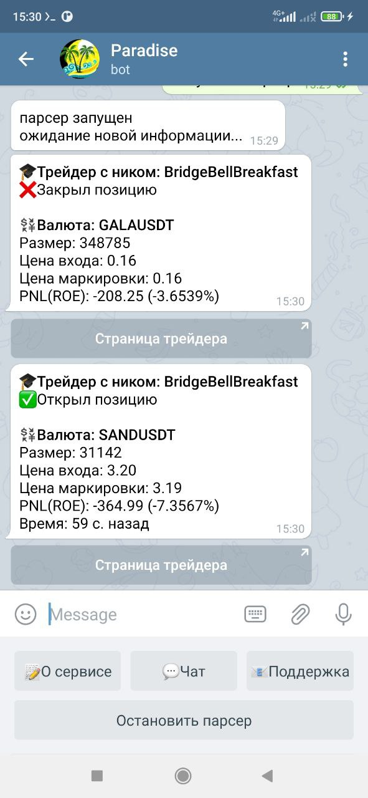

# Binance bot
## How this little project works:

1) put config.py in "C:\Users" directory with the next info
TOKEN = 'token for your telegram bot'
LOGIN, PASSWORD = 'vk_login', 'vk_password'

2) py retriever.py for launching a parses which will automatically retrieve all the data for define list of traders (open and close positions)
3) py tel.py for launch the bot

